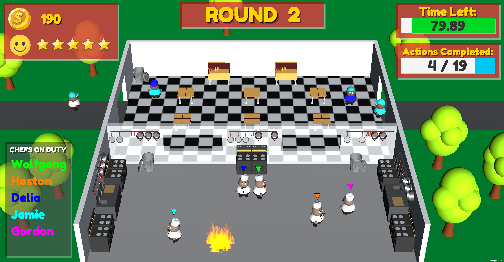

# KhaosKitchen

Khaos Kitchen Mobile is a fast-paced mobile party game where 2-8 players become the staff of a crazy kitchen! Players must work together to perform a wide range of actions to keep their restaurant open for as long as possible.

Khaos Kitchen was created by 6 students from the University of Bristol. It was developed using Unity Game Engine and C#. All of the in-game models and animations were created using Autodesk Maya.

The game makes use of the full range of modern smartphone hardware features. The players are instructed to complete a variety of tasks using the accelerometer, microphone, camera and NFC scanner throughout the rounds. 

Each round of Khaos Kitchen requires the team of chefs to complete a certain number of tasks to keep their restaurant alive and progress to the next round. Successfully completing tasks will keep customers happy and players can see their restaurant grow in popularity on the central screen. However, if the chefs make too many mistakes or fail to complete their instructions, the restaurant will be shut down and it's Game Over! Just like in a real restaurant, speed and accuracy are the keys to success.

